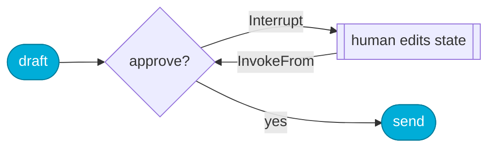

<div align="center">

# minigraph

**A stateful, graph-based agent runtime for Go — in 419 lines.**

[](https://pkg.go.dev/github.com/tomerfooks/minigraph)
[](https://github.com/tomerfooks/minigraph/actions/workflows/ci.yml)
[](https://goreportcard.com/report/github.com/tomerfooks/minigraph)
[](https://go.dev/dl/)
[](LICENSE)

</div>

---

> **The take:** Go is the best language for building web servers and agents —
> better than Python or JavaScript. It compiles to one lean binary, drags no
> runtime zoo behind it, and still reads clearly at 3 a.m. And agents don't
> need a fancy framework: a single graph engine is enough to build both lean
> agents *and* dynamic workflows. minigraph is that engine — nodes over typed
> state, cyclic edges, and nothing you didn't ask for.

Wire a graph of **nodes** that transform a shared, typed **state**, with
**edges** that are static or state-dependent. Cycles are first-class — the
whole difference between a flowchart and an agent that loops until it's done.

```go
app, _ := minigraph.New[State]().
    AddNode("agent", callModel).
    AddNode("tools", runTools).
    AddEdge(minigraph.Start, "agent").
    AddRouter("agent", func(ctx context.Context, s State) (string, error) {
        if s.Done {
            return minigraph.End, nil
        }
        return "tools", nil // else: call tools, then loop back to the model
    }).
    AddEdge("tools", "agent").
    Compile()

final, err := app.Invoke(ctx, State{Question: "..."})
```


## Why so small?

LangGraph is excellent — and enormous. minigraph keeps the ideas that carry
their weight and drops the machinery you rarely touch.

```text
LangGraph core + checkpoints (Python)  ████████████████████████████  ~33,700 loc
minigraph (Go)                         ▏  419 loc
```

Same shape — `StateGraph`, conditional edges, cycles, `invoke`/`stream`,
checkpointers, `interrupt()`, parallel fan-out — at **~1.2%** of the code,
**zero** third-party dependencies, and state typed by the compiler instead of
by a runtime schema.

## Features

| | |
|---|---|
| 🧩 **Typed state** | No `map[string]any`. Your struct *is* the schema. |
| 🔁 **Cycles** | First-class loops, not a bolted-on escape hatch. |
| 🌊 **Streaming** | `Stream` is an `iter.Seq2` — observe a run with `for … range`. |
| 💾 **Durable threads** | Every step is a resume point. Crash, restart, continue. |
| 🙋 **Human-in-the-loop** | Return an `Interrupt` to pause for approval, resume with edits. |
| 🍴 **Parallel fan-out** | Concurrent branches as one graph step, with a merge you control. |
| 🪆 **Free subgraphs** | `App.Invoke` *is* a `Node`, so graphs nest for free. |
| ✅ **Compile-time checks** | Dangling edges and dead ends fail at `Compile`, not at 2 a.m. |

## Install

```sh
go get github.com/tomerfooks/minigraph
```

## Examples

```sh
go run ./examples/agent      # minimal agent ⇄ tools loop
go run ./examples/react      # full ReAct loop: Thought → Action → Observation
go run ./examples/approval   # human-in-the-loop on a durable thread
go run ./examples/fanout     # parallel researchers merged into one report
```

## Three patterns worth seeing

**Human-in-the-loop.** A node pauses by returning an `Interrupt`; unlike an
error, the state it returns is kept. Answer by editing that state and resuming.



```go
final, err := app.Invoke(ctx, initial)
var intr *minigraph.Interrupt
if errors.As(err, &intr) {
    final.Approved = true // the human's answer, written into the state
    final, err = app.InvokeFrom(ctx, minigraph.Step[State]{Node: intr.Node, State: final})
}
```

**Parallel fan-out.** `Parallel` folds N branches into one node — and since a
compiled graph's `Invoke` is a `Node`, whole subgraphs can be branches.


```go
research := minigraph.Parallel(mergeFindings, searchWeb, searchDocs, subgraph.Invoke)
g.AddNode("research", research)
```

**Durable threads.** Every yielded `Step` is a checkpoint. A `Checkpointer`
(in-memory `MemorySaver` included) persists the latest one per thread, so a run
survives a crash and picks up where it stopped.

```go
saver := &minigraph.MemorySaver[State]{}
final, err := app.InvokeThread(ctx, saver, "thread-42", initial)
```

## Coming from LangGraph

| LangGraph | minigraph |
|---|---|
| `StateGraph(State)` | `New[State]()` — state is any Go type, checked at compile time |
| node function | `func(ctx, S) (S, error)` |
| `add_edge` / `add_conditional_edges` | `AddEdge(from, to)` / `AddRouter(from, router)` |
| `START` / `END` | `minigraph.Start` / `minigraph.End` |
| `compile()` → `invoke` / `stream` | `Compile()` → `Invoke` / `Stream` (an `iter.Seq2`) |
| recursion limit | `App.MaxSteps` (default 25) |
| checkpointer + `thread_id` | `Checkpointer` / `MemorySaver`, `InvokeThread` / `StreamThread` |
| `interrupt()` | return `&Interrupt{...}`; `InvokeFrom` to continue |
| `Send` / parallel supersteps | `Parallel(merge, branches...)` |
| subgraphs | free: `App.Invoke` is a valid `Node` |

## Design in one breath

A node returns the **whole** next state, so there are no reducers — which is
how minigraph skips LangGraph's largest subsystem. Each node has exactly one
outgoing edge (a static edge is just a router that ignores the state). A run is
a `(node, state)` pair advancing, so **every step is a checkpoint** — interrupts,
durability, and retries all fall out of that single fact. Parallelism lives in
`Parallel`, where *you* write the merge, keeping the graph deterministic and the
state a plain typed value. Wiring mistakes fail at `Compile`, joined and all at
once.

**Out of scope by choice:** per-key reducers, token streaming, retry policies,
and the platform layer. Nodes are plain functions — the rest composes from
outside.

## Testing

```sh
go test -race ./...
```

More test code than library code: linear and cyclic runs, every compile-time
validation, streaming with early `break`, context cancellation, node/router
errors, interrupt-and-resume, durable threads, and concurrent invocation.

## License

[MIT](LICENSE) © Tomer Fooks
