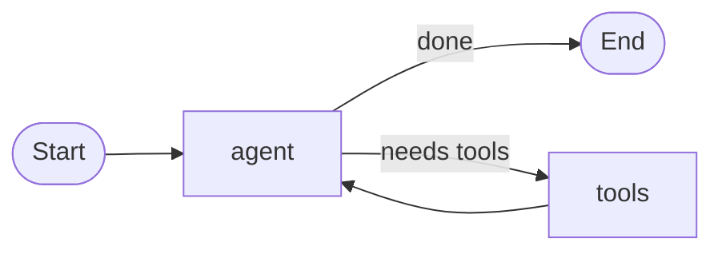

<div align="center">

# minigraph

**A stateful, graph-based agent runtime for Go — in ~420 lines.**

LangGraph's core ideas (typed state, cyclic graphs, streaming, checkpointing,
human-in-the-loop, parallel fan-out) distilled into one dependency-free
package you can read in a sitting.

[](https://pkg.go.dev/github.com/tomerfooks/minigraph)
[](https://github.com/tomerfooks/minigraph/actions/workflows/ci.yml)
[](https://goreportcard.com/report/github.com/tomerfooks/minigraph)
[](https://go.dev/dl/)
[](LICENSE)

</div>

---

Build agents and workflows as a graph of **nodes** that transform a shared,
typed **state**, wired with **edges** — static or conditional. Cycles are
first-class: a node can route back to an earlier one, which is exactly what
turns a pipeline into an agent that loops until it's done.

```go
app, _ := minigraph.New[State]().
    AddNode("agent", callModel).
    AddNode("tools", runTools).
    AddEdge(minigraph.Start, "agent").
    AddRouter("agent", func(ctx context.Context, s State) (string, error) {
        if s.Done {
            return minigraph.End, nil
        }
        return "tools", nil // otherwise call tools, then loop back to the agent
    }).
    AddEdge("tools", "agent").
    Compile()

final, err := app.Invoke(ctx, State{Question: "..."})
```



## Why

LangGraph is excellent — and large. minigraph keeps the ~80% of the model that
matters for most agents and drops the machinery you rarely touch, trading a
heap of features for something you can actually hold in your head.

| | Lines of code (no tests) |
|---|--:|
| LangGraph core + checkpoint libraries (Python) | ~33,700 |
| **minigraph** (Go) | **419** |

Same shape — `StateGraph`, conditional edges, cycles, `invoke`/`stream`,
checkpointers, `interrupt()`, parallel fan-out — at **~1.2%** of the code, with
**zero dependencies** beyond the Go standard library, and typed state checked
by the compiler instead of at runtime.

## Features

- 🧩 **Typed state via generics** — no `map[string]any`, no schema DSL. Your struct *is* the schema; the compiler enforces it.
- 🔁 **Cycles are first-class** — the difference between a DAG pipeline and a real agent loop.
- 🌊 **Streaming built in** — `Stream` is a Go 1.23 `iter.Seq2`, so observing every step is just `for step, err := range`.
- 💾 **Checkpointing & durable threads** — every step is a resume point; crash, restart, continue where it stopped.
- 🙋 **Human-in-the-loop** — a node returns an `Interrupt` to pause for approval, then resumes with the edited state.
- 🍴 **Parallel fan-out/join** — run branches concurrently as a single graph step, with a merge you control.
- 🪆 **Free subgraphs** — a compiled `App.Invoke` *is* a `Node`, so graphs nest with no special support.
- ✅ **Fails at `Compile`, not mid-run** — dangling edges, dead ends, and duplicate nodes are all reported up front.
- 🧵 **Concurrency-safe** — a compiled `App` is immutable; run it from as many goroutines as you like.

## Install

```sh
go get github.com/tomerfooks/minigraph
```

Requires Go 1.24+ (uses `iter`, `maps`, and `slices` from the standard library).

## Examples

Four runnable programs, each a self-contained pattern:

| Command | Pattern |
|---|---|
| `go run ./examples/agent` | Minimal agent ⇄ tools loop |
| `go run ./examples/react` | Full **ReAct** loop: Thought → Action → Observation, with a trace and a swappable mock LLM |
| `go run ./examples/approval` | **Human-in-the-loop**: interrupt, reject with feedback, redraft, approve — on a durable thread |
| `go run ./examples/fanout` | **Parallel** researchers merged into one report |

## A tour of the API

### Streaming

`Stream` returns a standard iterator, so watching a run is an ordinary loop —
`break` stops it, and the `Step` you keep is a checkpoint you can resume from:

```go
for step, err := range app.Stream(ctx, initial) {
    if err != nil { /* handle */ }
    fmt.Println(step.Node, step.State)
}
```

### Checkpoints & durable threads

Every `Step` a run yields is a checkpoint; `InvokeFrom(ctx, step)` continues
from exactly that point. The `Checkpointer` interface (with an in-memory
`MemorySaver` included) persists the latest step per thread, and the `*Thread`
methods make a run durable — die anywhere, run again, continue:

```go
saver := &minigraph.MemorySaver[State]{}
final, err := app.InvokeThread(ctx, saver, "thread-42", initial)
```

### Human-in-the-loop

A node pauses by returning an `Interrupt`. Unlike an error, the state it
returns is kept — the outside world answers by editing that state and resuming
from the interrupted node:

```go
final, err := app.Invoke(ctx, initial)
var intr *minigraph.Interrupt
if errors.As(err, &intr) {
    fmt.Println("agent asks:", intr.Payload)
    final.Approved = true // the human's answer, written into the state
    final, err = app.InvokeFrom(ctx, minigraph.Step[State]{Node: intr.Node, State: final})
}
```

### Parallel fan-out

`Parallel` composes nodes into one node: branches run concurrently on copies of
the state, then a merge you write folds the results. Because `App.Invoke` has a
node's signature, whole compiled subgraphs can be branches:

```go
research := minigraph.Parallel(
    func(ctx context.Context, base State, results []State) (State, error) {
        for _, r := range results {
            base.Findings = append(base.Findings, r.Finding)
        }
        return base, nil
    },
    searchWeb, searchDocs, subgraph.Invoke,
)
g.AddNode("research", research)
```

## Coming from LangGraph

| LangGraph | minigraph |
|---|---|
| `StateGraph(State)` | `New[State]()` — state is any Go type, checked at compile time |
| node function | `func(ctx, S) (S, error)` — takes state, returns the next state |
| `add_edge` | `AddEdge(from, to)` |
| `add_conditional_edges` | `AddRouter(from, router)` — the router returns the next node's name |
| `START` / `END` | `minigraph.Start` / `minigraph.End` |
| `compile()` | `Compile()` — validates the whole graph, returns an immutable `App` |
| `invoke` | `Invoke(ctx, state)` |
| `stream` | `Stream(ctx, state)` — an `iter.Seq2[Step[S], error]` |
| recursion limit | `App.MaxSteps` (default 25) |
| checkpointer + `thread_id` | `Checkpointer` / `MemorySaver`, `InvokeThread` / `StreamThread` |
| `interrupt()` | return `&Interrupt{Payload: ...}` from a node, `InvokeFrom` to continue |
| `Send` / parallel supersteps | `Parallel(merge, branches...)` — fan-out/join as a node combinator |
| subgraphs | free: `App.Invoke` is a valid `Node`, so `g.AddNode("sub", sub.Invoke)` |

## Design choices

- **Typed state, no reducers.** A node returns the whole next state; branching
  logic reads it directly. The Go compiler is the schema validator. This one
  decision is what lets minigraph skip LangGraph's largest subsystem (channels
  and per-key reducers).
- **Exactly one outgoing edge per node.** A static edge is just a router that
  ignores the state, so control flow always has one place to look.
- **Every `Step` is a checkpoint.** There's no separate checkpoint type or
  replay engine: a run is a `(node, state)` pair advancing, so any yielded pair
  is a resume point. Interrupts, durability, and retries all fall out of that
  one fact.
- **Fork/join instead of supersteps.** Parallelism lives inside `Parallel`,
  where *you* write the merge — the graph stays deterministic and the state
  stays a plain typed value. (Inside a branch, treat shared reference fields as
  read-only and let the merge reconcile.)
- **Fail at `Compile`, not mid-run.** Wiring mistakes accumulate and come back
  joined, all at once.

**Deliberately out of scope:** per-key state reducers, multiple streaming
modes, token streaming, retry policies, and the platform layer (studio,
tracing, deployment). Nodes are plain functions — LLM calls, retries, and
telemetry compose from the outside.

## Testing

```sh
go test -race ./...
```

The suite covers linear and cyclic runs, every compile-time validation,
streaming and early `break`, context cancellation, node/router errors,
interrupt-and-resume, durable threads, and concurrent invocation — with more
test code than library code.

## License

[MIT](LICENSE) © Tomer Fooks
