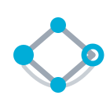
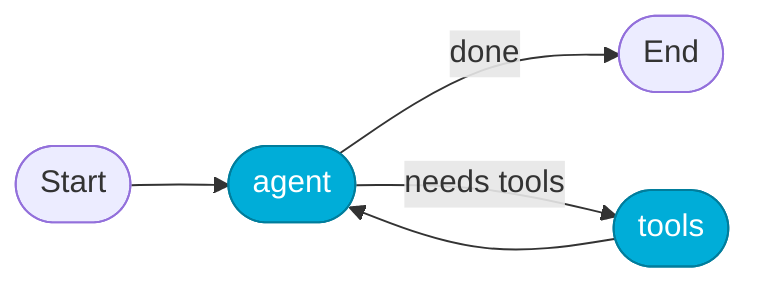
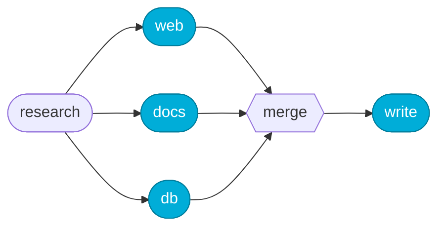

<div align="center">



# minigraph

**A stateful, graph-based agent runtime for Go.**
**419 lines — with the comments in. Zero dependencies. You can read all of it.**

[](https://pkg.go.dev/github.com/tomerfooks/minigraph)
[](https://github.com/tomerfooks/minigraph/actions/workflows/ci.yml)
[](https://goreportcard.com/report/github.com/tomerfooks/minigraph)
[](https://go.dev/dl/)
[](LICENSE)

</div>

---

> **The take.** Go is the best language for building web servers and agents —
> better than Python or JavaScript — because of what it's always been:
> compiled, lean, simple. One static binary, no runtime zoo, code that still
> reads clearly at 3 a.m. And agents don't need a fancy framework. One small
> graph engine covers lean agents *and* dynamic workflows. minigraph is that
> engine — nodes over typed state, cyclic edges, and nothing you didn't ask for.

## Sixty seconds

An agent is a graph of **nodes** transforming a shared, typed **state**, with
**edges** that are static or decided by the state at runtime. Cycles are
first-class — the entire difference between a flowchart and an agent that
loops until it's done.

```go
app, _ := minigraph.New[State]().
    AddNode("agent", callModel).
    AddNode("tools", runTools).
    AddEdge(minigraph.Start, "agent").
    AddRouter("agent", func(ctx context.Context, s State) (string, error) {
        if s.Done {
            return minigraph.End, nil
        }
        return "tools", nil // else: run tools, then loop back to the model
    }).
    AddEdge("tools", "agent").
    Compile()

final, err := app.Invoke(ctx, State{Question: "..."})
```



And here's a full ReAct loop running on it, offline, right now:

```console
$ go run ./examples/react
Question: What is twice the population of France?
Thought: I need France's population before I can double it.
Action: lookup[population of France]
Observation: 68000000
Thought: Now I double the population I found.
Action: calculate[68000000 * 2]
Observation: 136000000
Final Answer: Twice the population of France is 136000000.
```

```sh
go get github.com/tomerfooks/minigraph
```

## Why so small

LangGraph is excellent — and enormous. minigraph keeps the ideas that carry
their weight and drops the machinery you rarely touch.

```text
LangGraph core + checkpoints (Python)  ████████████████████████████  ~33,700 loc
minigraph (Go)                         ▏  419 loc
```

Same shape — typed state, conditional edges, cycles, invoke/stream,
checkpointers, interrupts, parallel fan-out — at **~1.2%** of the code, with
state checked by the compiler instead of a runtime schema.

## The entire API

Not "getting started" — this is the whole surface:

```go
minigraph.Start, minigraph.End          // reserved endpoints of every run
type Node[S any]   = func(ctx, S) (S, error)      // transforms the state
type Router[S any] = func(ctx, S) (string, error) // picks the next node

New[S]().AddNode(…).AddEdge(…).AddRouter(…).Compile() → (*App[S], error)

app.Invoke(ctx, state)                  // run to completion
app.Stream(ctx, state)                  // iter.Seq2[Step[S], error] — just range over it
app.InvokeFrom(ctx, step)               // resume any yielded Step (every Step is a checkpoint)
app.StreamFrom(ctx, step)
app.InvokeThread(ctx, saver, id, state) // durable runs: load, run, save every step
app.StreamThread(ctx, saver, id, state)
app.MaxSteps                            // runaway-cycle guard, default 25

Parallel(merge, branches...)            // concurrent fan-out/join, packaged as one Node
&Interrupt{Payload: …}                  // return from a node to pause for a human
Checkpointer[S] · MemorySaver[S]        // persistence interface + in-memory impl
Step[S]{Node, State}                    // one executed step — and a resume point
```

If you've read this far, you already know the library.

## The patterns

**Human-in-the-loop.** A node pauses by returning an `Interrupt`; unlike an
error, the state it returns is kept. Answer by editing that state and resuming
— the run picks up as if the pause never happened.


```go
final, err := app.Invoke(ctx, initial)
var intr *minigraph.Interrupt
if errors.As(err, &intr) {
    final.Approved = true // the human's answer, written into the state
    final, err = app.InvokeFrom(ctx, minigraph.Step[State]{Node: intr.Node, State: final})
}
```

**Parallel fan-out.** `Parallel` folds N concurrent branches into one node,
with a merge you write. And because a compiled graph's `Invoke` *is* a `Node`,
whole subgraphs can be branches — nested parallelism with no special support.



```go
research := minigraph.Parallel(mergeFindings, searchWeb, searchDocs, subgraph.Invoke)
```

**Durable threads.** Every yielded `Step` is a checkpoint; a `Checkpointer`
persists the latest one per thread. Crash anywhere — a deploy, a panic, a
pulled plug — run the thread again and it continues where it stopped. Failed
steps aren't saved, so a rerun retries them for free.

```go
saver := &minigraph.MemorySaver[State]{}
final, err := app.InvokeThread(ctx, saver, "thread-42", initial)
```

Four runnable examples, no API keys required:

```sh
go run ./examples/agent      # minimal agent ⇄ tools loop
go run ./examples/react      # ReAct: Thought → Action → Observation, swappable mock LLM
go run ./examples/approval   # human-in-the-loop on a durable thread
go run ./examples/fanout     # parallel researchers merged into one report
```

## Coming from LangGraph

| LangGraph | minigraph |
|---|---|
| `StateGraph(State)` | `New[State]()` — state is any Go type, checked at compile time |
| node function | `func(ctx, S) (S, error)` |
| `add_edge` / `add_conditional_edges` | `AddEdge(from, to)` / `AddRouter(from, router)` |
| `START` / `END` | `minigraph.Start` / `minigraph.End` |
| `compile()` → `invoke` / `stream` | `Compile()` → `Invoke` / `Stream` |
| recursion limit | `App.MaxSteps` |
| checkpointer + `thread_id` | `Checkpointer`, `InvokeThread` / `StreamThread` |
| `interrupt()` | return `&Interrupt{…}`; `InvokeFrom` to continue |
| `Send` / parallel supersteps | `Parallel(merge, branches...)` |
| subgraphs | free — `App.Invoke` is a valid `Node` |

## Design, in one breath

A node returns the **whole** next state, so there are no reducers — which is
how minigraph skips LangGraph's largest subsystem. Every node has exactly one
outgoing edge (a static edge is a router that ignores the state), so control
flow has one place to look. A run is a `(node, state)` pair advancing, so
**every step is a checkpoint** — interrupts, durability, and retries fall out
of that single fact. Parallelism lives in `Parallel`, where you write the
merge, keeping the graph deterministic. And wiring mistakes fail at `Compile`,
joined, all at once — not at 2 a.m., one at a time.

**Out of scope, on purpose:** per-key reducers, token streaming, retry
policies, the platform layer. Nodes are plain functions; everything else
composes from outside.

## FAQ

**Is it production-ready?** It's 419 lines with more test code than library
code. Read it over one coffee and you'll know it better than most of your
dependencies.

**Where are the LLM bindings?** There aren't any. A node is
`func(ctx, S) (S, error)` — call your model inside one. Any client, any
provider, no adapter layer.

**Why not just use LangGraph?** If you're in Python, do. If you're in Go and
want the whole runtime in your head, welcome home.

## Development

```sh
go test -race ./...   # linear & cyclic runs, compile-time validations, streaming,
                      # cancellation, interrupts, durable threads, concurrency
```

## License

[MIT](LICENSE) © Tomer Fooks
