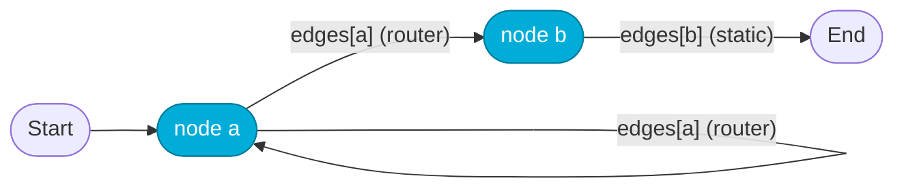
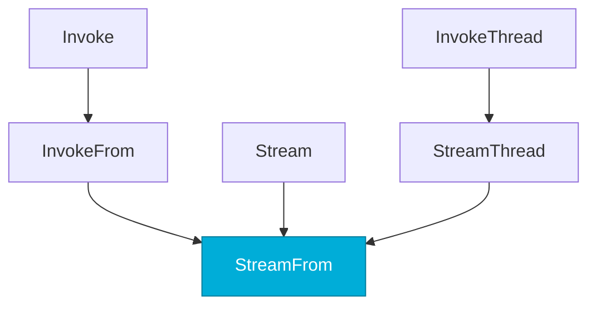
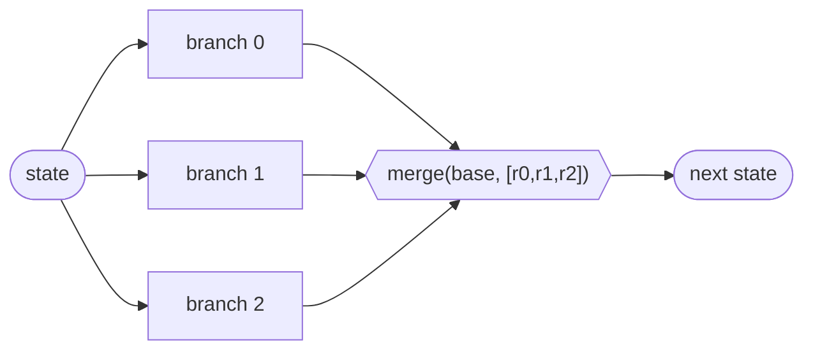

# MiniGraph architecture

This document is for people evaluating MiniGraph. It explains the model the
library implements, walks through the single execution engine line by line,
and traces two runs step by step. Line references are to the files at the
repository root as of commit `51ec765`. The library is 420 lines across four
files; the total including tests, examples, README and CI is about 1,960.

Verified at the time of writing (Go 1.26.5, darwin/amd64):

```
go test -race ./...     ok    github.com/tomerfooks/minigraph   1.433s
go test -cover ./...    ok    coverage: 97.8% of statements
go vet ./...            clean
gofmt -l .              clean
```

---

## 1. Mental model

A MiniGraph program is a state machine over a single, user-defined Go type `S`.

- **State** is any Go type. There is no schema, no `map[string]any`, and no
  reducer. The compiler checks it.
- **Node** (`graph.go:29`) is `func(ctx, S) (S, error)`. It receives the whole
  state and returns the whole next state. It does not "update keys"; it
  replaces the value.
- **Router** (`graph.go:32`) is `func(ctx, S) (string, error)`. It runs after a
  node and names the next node, or `End`.
- **Edge** (`graph.go:34-37`) is either static (`to` set, `router == nil`) or
  conditional (`router` set). **Every node has exactly one outgoing edge**; a
  static edge is just a router that ignores the state. Consequently control
  flow for node `X` lives in exactly one place: `edges[X]`.
- **Start / End** (`graph.go:18-21`) are reserved names. `Start` may be the
  `from` of an edge (including a router, which gives a conditional entry
  point); `End` may be a target. Neither can be a node (`graph.go:59`), and
  neither can be routed *to* except `End` (`graph.go:235`).
- **Cycles are ordinary.** A router that names an earlier node is a loop; the
  only guard is `MaxSteps`.



The public surface is the README's "entire API" block: `New`, `AddNode`,
`AddEdge`, `AddRouter`, `Compile`, `App.{Invoke,Stream,InvokeFrom,StreamFrom,
InvokeThread,StreamThread,MaxSteps}`, `Step`, `Interrupt`, `Checkpointer`,
`MemorySaver`, `Parallel`, `Start`, `End`, `ErrMaxSteps`.

---

## 2. Build, compile, freeze

`Graph[S]` (`graph.go:41-45`) is a mutable builder holding `nodes`, `edges`,
and an `errs` slice. Every builder method returns `*Graph[S]` for chaining and
**never fails loudly**: a mistake is appended to `errs` via `fail`
(`graph.go:52-55`) and the chain continues. Builder-time checks:

| Method | Rejects |
|---|---|
| `AddNode` (`graph.go:58-70`) | empty name, `Start`, `End`, nil func, duplicate name |
| `AddRouter` (`graph.go:80-85`) | nil router |
| `addEdge` (`graph.go:87-93`) | a second outgoing edge from the same node |

`Compile` (`graph.go:97-130`) clones `errs`, then adds structural checks in
deterministic (sorted) order:

1. `edges[Start]` must exist (`graph.go:103-105`).
2. Every node must have an outgoing edge (`graph.go:106-110`).
3. Every edge's `from` must be a node or `Start` (`graph.go:113-115`).
4. Every *static* edge's `to` must be a node or `End` (`graph.go:116-120`).
   Router targets cannot be checked statically; they are checked at run time
   in `route`.

All problems are returned at once through `errors.Join` (`graph.go:122`).
`TestCompileErrors` (`graph_test.go:175-258`) pins each message.

On success `Compile` returns an `App[S]` (`graph.go:133-140`) built from
`maps.Clone` of both maps (`graph.go:126-127`), so later mutation of the
builder cannot reach the compiled app (`TestAppIsolatedFromBuilder`,
`graph_test.go:350`). `App` has no mutating methods and its maps are only
read, which is why it is safe for concurrent `Invoke`s
(`TestConcurrentInvokes`, `graph_test.go:369`). The one exported field,
`MaxSteps`, is set to 25 by `Compile` (`graph.go:128`) and is meant to be set
once before the app is shared.

Not checked at compile time, by design: reachability (an unreferenced node
with a valid edge compiles fine, since a router may name it) and router
targets.

---

## 3. The single engine: `StreamFrom`

Every public run method is a thin wrapper:



- `Stream(ctx, s)` (`graph.go:154-156`) = `StreamFrom(ctx, Step{Start, s})`.
- `Invoke(ctx, s)` (`graph.go:209-211`) = `InvokeFrom(ctx, Step{Start, s})`.
- `InvokeFrom` (`graph.go:214-223`) ranges over `StreamFrom`, keeps the last
  `step.State`, and returns on the first error. Because the error pair carries
  the last good state, `Invoke` on failure returns the last state a node
  produced successfully.
- `StreamThread` / `InvokeThread` (`checkpoint.go:51-93`) wrap `StreamFrom`
  with load-before and save-after.

`StreamFrom` (`graph.go:161-205`) returns an `iter.Seq2[Step[S], error]`. It
is a pull-free push iterator: no goroutine, no channel, so breaking out of the
`range` loop simply returns from the function (`graph.go:199-201`,
`TestStreamBreak`). Its body, annotated:

```go
at, state := from.Node, from.State                       // 163
if _, ok := r.nodes[at]; !ok && at != Start { yield(from, err); return }  // 164-167
for steps := 0; ; steps++ {                              // 168
    if err := ctx.Err(); err != nil { yield({at,state}, err); return }    // 169-172
    next, err := r.route(ctx, at, state)                 // 173
    if err != nil { yield({at,state}, err); return }     // 174-177
    if next == End { return }                            // 178-180
    if steps >= r.MaxSteps { yield({at,state}, ErrMaxSteps); return }     // 181-184
    out, err := r.nodes[next](ctx, state)                // 185
    if intr := (*Interrupt)(nil); errors.As(err, &intr) {                 // 186
        yield({next, out}, &Interrupt{intr.Payload, next}); return        // 189
    }
    if err != nil { yield({at,state}, fmt.Errorf("node %q: %w", next, err)); return } // 192-196
    state = out                                          // 198
    if !yield({next, state}, nil) { return }             // 199-201
    at = next                                            // 202
}
```

Order matters and is deliberate:

1. **Context is checked before routing** (`graph.go:169`, added in `51ec765`),
   so a cancelled context stops the run between nodes even when nodes ignore
   `ctx`. The yielded Step is `{at, state}`, i.e. the last completed node.
2. **Routing happens before the step budget**, so a run that has used exactly
   `MaxSteps` executions and then routes to `End` succeeds. `MaxSteps` is the
   number of *node executions* allowed (`TestMaxSteps` expects `N == 5` with
   `MaxSteps = 5`).
3. **Resuming from an unknown node is an error, not a panic**
   (`graph.go:164-167`, `TestResumeUnknownNode`).

`route` (`graph.go:226-239`) resolves `edges[at]`: a static edge returns `to`
unchecked (Compile already validated it); a router's answer is validated
against `nodes` or `End` and any failure is wrapped with `edge from %q`. A
router returning `Start`, `""`, or a typo is a run-time error
("routed to unknown node").

---

## 4. `Step` is both the event and the checkpoint

```go
type Step[S any] struct { Node string; State S }   // graph.go:145-148
```

Every value the iterator yields is a `(node, state)` pair, and `StreamFrom`
accepts exactly that pair as its starting point. Nothing else is needed to
resume: no run id, no step counter, no separate checkpoint type. The
semantics of resume are fixed by one sentence at `graph.go:158-160`:

> routing restarts *from* `from.Node` with `from.State`, so the checkpointed
> node is **not** re-executed.

That single rule, combined with *which* Step the engine chooses to yield in
each situation, gives interrupts, retries, and durability without extra
machinery.

### 4.1 The three yield conventions

| Situation | Step yielded (`graph.go`) | Error | Effect of `InvokeFrom(step)` |
|---|---|---|---|
| Node succeeded | `{next, out}` (199) | `nil` | routes onward from the node; continues |
| Node returned a plain error | `{at, state}` — the **last completed** node and its state (195) | `node "next": err` | routes from `at` again, which re-selects and **re-runs the failed node** |
| Node returned `*Interrupt` | `{next, out}` — the **interrupted** node and the state it returned (189) | `*Interrupt{Payload, Node: next}` | routes onward from the interrupted node; it does **not** re-run |

Also: router error, context error, and `ErrMaxSteps` all yield `{at, state}`
(last good), so they behave like a plain error on resume.

Why this works: the engine never distinguishes "a checkpoint" from "a Step".
Whether the Step points at the failed node's predecessor (retry) or at the
node that paused (skip) is decided at yield time, and the resume rule is
always the same. Pinned by `TestErrorStepRetriesFailedNode`
(`graph_test.go:310`), `TestInterruptAndResume` (`interrupt_test.go:39`),
`TestResumeFromMidRun` (`checkpoint_test.go:25`). Changing any one of the
three rows silently breaks one of those.

A direct consequence worth internalizing: **after an interrupt, the decision
of what to do with the human's answer belongs in the router after the
interrupted node, not in the node itself**, because the node will not run
again. `examples/approval/main.go:35-53` shows the shape: `approve` only
pauses; the router on `approve` reads `s.Approved`.

---

## 5. Durability: `Checkpointer`, `StreamThread`, `InvokeThread`

```go
type Checkpointer[S any] interface {                    // checkpoint.go:15-18
    Save(ctx, thread string, step Step[S]) error
    Load(ctx, thread string) (Step[S], bool, error)
}
```

A checkpointer stores **only the latest Step per thread**. There is no
history, no list, no delete. `MemorySaver` (`checkpoint.go:23-43`) is a
mutex-guarded `map[string]Step[S]` whose zero value is ready to use. It stores
`Step[S]` by value, so reference fields inside `S` still alias the live run.

`StreamThread` (`checkpoint.go:51-72`):

1. `Load(thread)`. If a Step exists, it becomes `from` and `initial` is
   ignored; otherwise `from = {Start, initial}` (`checkpoint.go:53-59`).
2. Range over `StreamFrom(from)`. For every pair where `err == nil` **or**
   `err` is an `*Interrupt`, `Save` **before** yielding (`checkpoint.go:61-66`).
   A `Save` failure is yielded as the error and ends the run.
3. Yield; stop on consumer break or any error (`checkpoint.go:67`).

What is saved and what is not:

| Outcome | Saved? | Effect of rerunning the thread |
|---|---|---|
| Node success | yes | continues from that node |
| Interrupt | yes (the interrupted node's Step) | routes onward from the interrupted node |
| Plain node error, router error, ctx error, `ErrMaxSteps`, `Save` error | **no** | resumes from the last saved Step, so the failed node runs again |
| Consumer `break` | the last yielded Step was already saved | continues from it (`TestStreamThreadResumesAfterBreak`) |

This is why "rerun retries": the last saved Step is always a last-good point,
and resume routes onward from it, which re-selects the node that failed.

`InvokeThread` (`checkpoint.go:81-93`) adds one thing: it loads the thread
first so that a **finished** thread (whose saved Step routes straight to
`End`, yielding nothing) returns its final state instead of `initial`
(`TestInvokeThread`, `checkpoint_test.go:84-91`). The doc comment at
`checkpoint.go:76-80` shows how to answer an interrupt on a thread: edit the
state, `Save` it under `intr.Node`, call `InvokeThread` again.

Two properties fall out of this design and should be understood before
relying on it:

- **At-least-once node execution.** A crash between a node finishing and its
  `Save` completing, or a `Save` error, means the node runs again on rerun.
  Nodes with external side effects should be idempotent or should key their
  effect on something in the state.
- **A finished thread and an interrupted thread look identical** to the
  checkpointer: both are `{node, state}`. The difference is only what
  `edges[node]` routes to. In particular, rerunning an interrupted thread
  *without editing the state* routes onward as if the human had answered.
  `gateGraph` (`interrupt_test.go:25-30`) and `examples/approval` both handle
  this with routers that re-ask when the answer is missing.

---

## 6. Interrupt semantics

```go
type Interrupt struct { Payload any; Node string }     // interrupt.go:24-27
```

A node pauses by returning `s, &Interrupt{Payload: ...}`. Rules:

- The state returned *alongside* the interrupt is kept (`graph.go:189`),
  unlike a plain error where the returned state is discarded. So a node can
  record what it asked in `S` before pausing.
- Detection is `errors.As(err, &intr)` on `*Interrupt` (`graph.go:186`), so a
  wrapped interrupt (`fmt.Errorf("x: %w", &Interrupt{...})`) is still an
  interrupt. The engine constructs a **fresh** `*Interrupt` with `Node` set
  to the pausing node (`graph.go:189`); any wrapper text and any user-set
  `Node` are dropped.
- `Interrupt` is not generic and `Payload` is `any`, so the same type serves
  every `S`.
- `Interrupt` is **not** part of the `Step`. It is not persisted by
  `StreamThread`. If the payload matters after a process restart, the node
  must also write it into the state.
- Resume routes onward from `intr.Node`; the node does not re-run.

`examples/approval/main.go` runs the full loop on a durable thread: draft,
interrupt, human edits state, `Save` under `intr.Node`, `InvokeThread` again;
the router on `approve` sends either to `send` or back to `draft`.

---

## 7. `Parallel`

`Parallel(merge, branches...)` (`parallel.go:22-57`) returns a **single
`Node[S]`**. The graph engine does not know about it; it is one step, one
Step, one checkpoint. Behaviour:

- Nil `merge` is a run-time error at call time (`parallel.go:24-26`).
- A child context is created and cancelled on return (`parallel.go:27-28`).
- Each branch runs in its own goroutine and receives `state` by value
  (`parallel.go:40`), i.e. a **shallow copy**: scalars are private, slices,
  maps and pointers are shared. Branches should treat shared data as
  read-only and put results in their own copy (`examples/fanout/main.go`
  writes `s.Finding` on the copy; `merge` folds into `base.Findings`).
- Results are stored at `results[i]`, so `merge` receives them **in branch
  order** regardless of completion order (`TestParallelMergesInBranchOrder`).
- The first error wins via `sync.Once`, cancels the child context, and the
  node returns the **input** state with `parallel branch %d: %w`
  (`parallel.go:42-45`, `52-54`). Sibling results are discarded.
  `wg.Wait()` (`parallel.go:51`) means the node returns only after **every**
  branch has returned; a branch that ignores `ctx` delays the error.
- Because `App.Invoke` has a `Node`'s signature, a compiled subgraph is a
  valid branch (`TestParallelSubgraphBranches`).

The documented rule "an Interrupt inside a branch is treated as a plain
error" (`parallel.go:20-21`, `interrupt.go:22-23`) does **not** match the
code: `%w` at `parallel.go:43` makes `errors.As` at `graph.go:186` succeed.
See `code-review.md`, finding 1, for the consequences.



---

## 8. Other invariants

- **MaxSteps** counts from zero on every `StreamFrom` call (`graph.go:168`),
  so it is a per-call guard, not a per-thread budget. Each `InvokeThread`
  rerun gets a fresh 25.
- **Context cancellation** is observed between nodes (`graph.go:169`) and is
  the caller's responsibility inside nodes. A pre-cancelled context yields
  `{Start, initial}` with `context.Canceled`.
- **Panics are not recovered.** A panic in a sequential node unwinds through
  the iterator into the caller's `range` loop, where a `defer recover()`
  catches it; nothing is yielded and nothing is saved. A panic inside a
  `Parallel` branch is on another goroutine and terminates the process.
- **Subgraphs are free.** `sub.Invoke` is a `Node[S]`; `sub.InvokeFrom`,
  `Parallel(...)`, and closures over an `App` all compose the same way. A
  subgraph's steps are not surfaced to the parent's stream; it is one Step.
- **Concurrency.** `App` is read-only after `Compile`; `MemorySaver` is
  mutex-guarded. Two goroutines driving the *same thread* concurrently is
  unsupported (last Save wins).

---

## 9. Walkthrough: a full run

Graph from `TestLinear` (`graph_test.go:24-46`): `Start → a → b → End`,
`a` increments `N`, `b` multiplies by 10, both append their name to `Path`.
`app.Invoke(ctx, state{})`.

| iter | `at` | `ctx.Err` | `route(at)` | budget | node executes | yields |
|---|---|---|---|---|---|---|
| 0 | `Start` | nil | `"a"` | 0 < 25 | `a({N:0})` → `{N:1, Path:[a]}` | `Step{a, {N:1,[a]}}`, nil |
| 1 | `a` | nil | `"b"` | 1 < 25 | `b({N:1,[a]})` → `{N:10, Path:[a,b]}` | `Step{b, {N:10,[a,b]}}`, nil |
| 2 | `b` | nil | `End` | — | — | return (no yield) |

`InvokeFrom` saw two pairs, `final = {N:10, Path:[a,b]}`, error nil.
`Stream` would have yielded exactly those two Steps (`TestStreamYieldsEveryStep`).
On a thread, `MemorySaver["t1"]` would hold `Step{b, {N:10,[a,b]}}` after the
run; a rerun loads it, routes `b → End`, yields nothing, and `InvokeThread`
returns the loaded state (`TestInvokeThread`).

---

## 10. Walkthrough: interrupt, answer, resume

Graph `gateGraph` (`interrupt_test.go:11-37`): `Start → prep → gate →(router)→
done | gate`, `prep` sets `N=1`, `gate` appends `"gate"` and interrupts if
`N < 10`, `done` doubles `N`. Router on `gate`: `N < 10 ? "gate" : "done"`.

**Run 1** — `paused, err := app.Invoke(ctx, state{})`:

| iter | `at` | route | executes | yields |
|---|---|---|---|---|
| 0 | `Start` | `prep` | `prep` → `{N:1,[prep]}` | `Step{prep, …}`, nil |
| 1 | `prep` | `gate` | `gate` → returns `{N:1,[prep,gate]}`, `&Interrupt{"need N >= 10"}` | `Step{gate, {N:1,[prep,gate]}}`, `*Interrupt{Node:"gate"}` — return |

`Invoke` returns `paused = {N:1, Path:[prep,gate]}` (the interrupt's state
was kept, including `gate`'s own append) and `err` is the `*Interrupt`.

**The human answers**: `paused.N = 10`.

**Run 2** — `app.InvokeFrom(ctx, Step{Node: "gate", State: paused})`:

| iter | `at` | route | executes | yields |
|---|---|---|---|---|
| 0 | `gate` | router sees `N=10` → `done` | `done` → `{N:20,[prep,gate,done]}` | `Step{done, …}`, nil |
| 1 | `done` | `End` | — | return |

`final = {N:20, Path:[prep,gate,done]}`. `gate` ran once in total.

**Had the human not edited the state** and simply resumed, iteration 0 would
route `gate → gate` (N still 1), re-execute `gate`, and interrupt again. That
is the "re-ask" pattern; with a static edge `gate → done` instead, the resume
would proceed to `done` unconditionally.

On a thread (`TestInterruptWithThread`): after run 1 the saver holds
`Step{gate, {N:1,…}}` (saved because it is an interrupt). The answer is
`saver.Save("t1", Step{gate, edited})`, and `InvokeThread` loads that and
proceeds as run 2.

---

## 11. What is deliberately not here, and how to compose it

The README and `AGENTS.md` list these as out of scope. Each can be built
outside the library because a node is a plain function and an `App` is a
value.

**Per-key reducers.** A node returns the whole state; if you want "append
to messages" semantics, write it in the node or wrap it:

```go
func appendMsgs(fn func(ctx context.Context, s State) ([]Msg, error)) minigraph.Node[State] {
    return func(ctx context.Context, s State) (State, error) {
        out, err := fn(ctx, s)
        if err != nil { return s, err }
        s.Messages = append(slices.Clone(s.Messages), out...) // clone: do not alias the checkpoint
        return s, nil
    }
}
```

**Retry policies.** Wrap the node; the engine sees one attempt:

```go
func retry[S any](n int, fn minigraph.Node[S]) minigraph.Node[S] {
    return func(ctx context.Context, s S) (S, error) {
        var out S; var err error
        for i := 0; i < n; i++ {
            if out, err = fn(ctx, s); err == nil || ctx.Err() != nil { return out, err }
            var intr *minigraph.Interrupt
            if errors.As(err, &intr) { return out, err } // never retry a pause
        }
        return s, err
    }
}
```

**Token streaming.** The engine streams *steps*, not tokens. Stream tokens
from inside the node through a channel or callback captured by the closure:

```go
tokens := make(chan string, 64)
g.AddNode("model", func(ctx context.Context, s State) (State, error) {
    text, err := llm.Stream(ctx, prompt(s), func(tok string) { tokens <- tok })
    s.Answer = text
    return s, err
})
```

**LLM bindings.** None; call the client inside a node. `examples/react/main.go`
shows a `type LLM func(ctx, prompt) (string, error)` seam with a mock.

**Persistence backends.** Implement the two-method interface; `Step[S]` has
exported fields and no custom marshalling, so JSON works when `S` does:

```go
type FileSaver[S any] struct{ dir string }
func (f FileSaver[S]) Save(_ context.Context, thread string, st minigraph.Step[S]) error {
    b, err := json.Marshal(st)
    if err != nil { return err }
    return os.WriteFile(filepath.Join(f.dir, thread+".json"), b, 0o600) // use rename for atomicity
}
func (f FileSaver[S]) Load(_ context.Context, thread string) (minigraph.Step[S], bool, error) {
    var st minigraph.Step[S]
    b, err := os.ReadFile(filepath.Join(f.dir, thread+".json"))
    if errors.Is(err, fs.ErrNotExist) { return st, false, nil }
    if err != nil { return st, false, err }
    return st, true, json.Unmarshal(b, &st)
}
```

**Step history / time travel.** Wrap a checkpointer to append every Save to a
log; the engine only needs `Load` to return the latest.

**Timeouts per node.** `context.WithTimeout` inside a wrapper node, same shape
as `retry`.

---

## 12. Line budget

| File | Lines | What it buys |
|---|---|---|
| `graph.go` | 239 | Types, builder with silent error accumulation, `Compile` validation, the engine (`StreamFrom`), the four run wrappers, `route`. About 90 of the 239 lines are doc comments. |
| `checkpoint.go` | 93 | `Checkpointer` interface, `MemorySaver`, `StreamThread` (load, run, save-before-yield), `InvokeThread` (finished-thread handling). |
| `interrupt.go` | 31 | The `Interrupt` type and `Error()`. 22 of 31 lines are the runnable doc example. |
| `parallel.go` | 57 | Fan-out/join combinator: child context, goroutine per branch, ordered results, first-error cancel. |
| **Library total** | **420** | Matches README's "420 lines" / "420 loc"; CI (`.github/workflows/ci.yml`) fails if the sum drifts from the README. |
| `graph_test.go` | 396 | Linear, loop, MaxSteps, node/router errors, compile errors, break, cancel, retry semantics, isolation, concurrency. |
| `checkpoint_test.go` | 130 | Resume mid-run, unknown node, MemorySaver, finished thread no-op, resume after break, Save error. |
| `interrupt_test.go` | 100 | Interrupt/resume with and without a thread. |
| `parallel_test.go` | 97 | Branch order, sibling cancel, subgraph branches, nil merge. |
| **Tests total** | **723** | 1.7x the library. |
| `examples/*/main.go` | 448 | agent, react, approval, fanout; compiled by CI, not executed. |

The ratio of doc comment to code is unusually high on purpose: the package is
meant to be read end to end (`AGENTS.md`, "Conventions").
