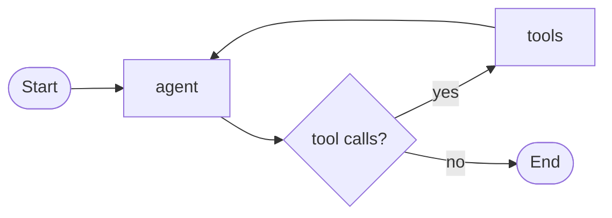
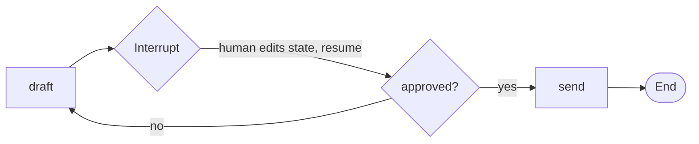
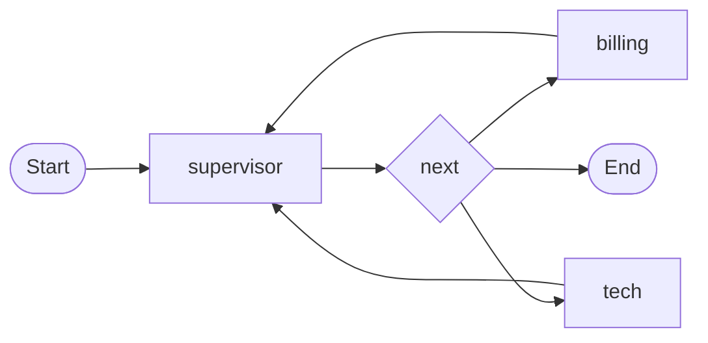
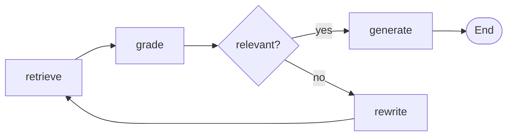
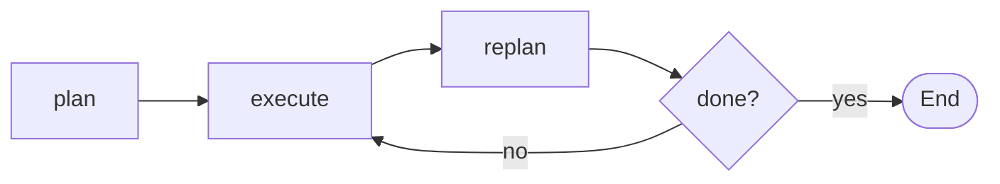
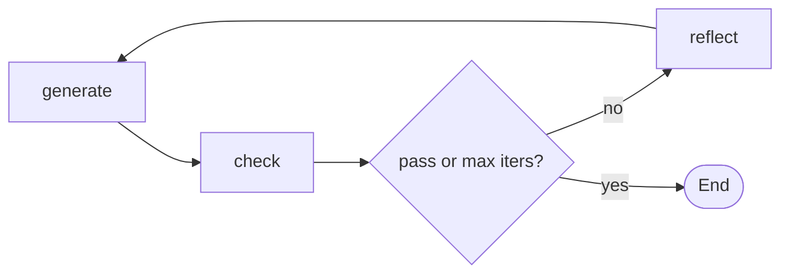
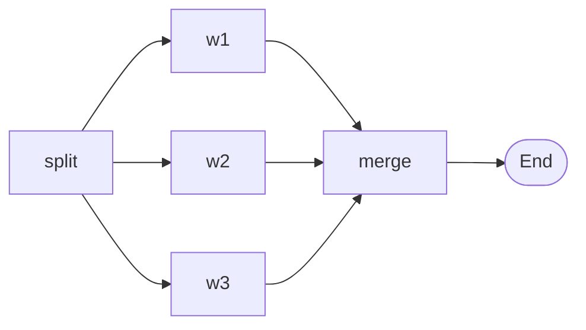
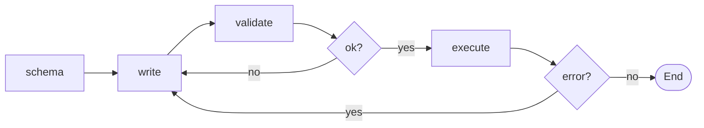

# MiniGraph use-case pack: what people build with LangGraph, where it hurts, and what to demo

Research notes for writing MiniGraph demos and tutorials. Compiled 2026-09-11.
Everything here is mapped to the actual MiniGraph surface: `Node = func(ctx, S) (S, error)`,
`Router = func(ctx, S) (string, error)`, `AddEdge`/`AddRouter`, `Invoke`/`Stream`/`InvokeFrom`/`StreamFrom`,
`InvokeThread`/`StreamThread` + `Checkpointer`, `Interrupt`, `Parallel(merge, branches...)`, `MaxSteps`.
No reducers, no token streaming, no LLM bindings. Gaps are called out explicitly rather than papered over.

---

## A. What people build with LangGraph (ranked)

Ranking is by how often the pattern shows up across LangChain's own docs, the "built with LangGraph"
case studies, and third-party tutorials. Two anchor documents recur everywhere: LangChain's
"Workflows and agents" page (prompt chaining, parallelization, routing, orchestrator-worker,
evaluator-optimizer, agent) at https://docs.langchain.com/oss/python/langgraph/workflows-agents,
which mirrors Anthropic's "Building effective agents" taxonomy at
https://www.anthropic.com/engineering/building-effective-agents. The company list is at
https://docs.langchain.com/oss/python/langgraph/case-studies (41 companies) and
https://www.langchain.com/blog/top-5-langgraph-agents-in-production-2024.

### 1. Tool-calling agent (ReAct loop)

The base case: model decides, tools run, loop until the model answers. Every LangGraph quickstart
and `create_react_agent` is this. A graph helps because the loop is a cycle with a data-dependent
exit, which is exactly what a static edge plus a router expresses; a plain `for` loop works too,
which is why it is also pain point B1.



Evidence: https://docs.langchain.com/oss/python/langgraph/quickstart,
https://docs.langchain.com/oss/python/langgraph/workflows-agents (section "Agent").
MiniGraph: `examples/agent` and `examples/react` already do this. Primitives: two nodes, one router,
`MaxSteps` as the recursion guard. No gap.

### 2. Human-in-the-loop approval / edit / validate

Pause before a side effect, let a person approve, edit state, or supply missing input, then continue.
Replit "emphasized human-in-the-loop and multi-agent setup" (https://www.langchain.com/breakoutagents/replit);
Elastic ships a HITL tutorial (https://www.elastic.co/search-labs/blog/human-in-the-loop-hitllanggraph-elasticsearch).
The LangGraph docs list four sub-patterns: approve/reject, review-and-edit state, interrupts inside
tools, validate human input (https://docs.langchain.com/oss/python/langgraph/interrupts).



MiniGraph: `examples/approval`. Return `&Interrupt{Payload}` from a node; the state it returns is
kept; `InvokeFrom(Step{Node: intr.Node, State: edited})` routes onward without re-running the node.
No gap; this is the cleanest area for MiniGraph because resume never replays (see B3).

### 3. Supervisor / router multi-agent

One node classifies or delegates; specialised workers do the job; control returns to the
supervisor until it says done. LangChain's multi-agent page enumerates subagents, handoffs, skills,
router, custom workflow (https://docs.langchain.com/oss/python/langchain/multi-agent). Klarna's
support assistant is described as a multi-agent system whose controllable routing "helped decrease
latency, improve reliability" (https://www.langchain.com/blog/customers-klarna). LinkedIn's SQL Bot
is "a multi-agent system ... routes different types of questions to specialized handlers"
(https://www.zenml.io/llmops-database/building-a-production-text-to-sql-assistant-with-multi-agent-architecture).



MiniGraph: supervisor is a node whose router returns the worker's name; every worker has a static
edge back to `supervisor`. Workers that are themselves graphs plug in as `sub.Invoke`. Handoffs
(worker-to-worker) are just routers on the workers. No gap.

### 4. Corrective / self-reflective RAG (grade, rewrite, retry)

Retrieve, grade relevance, and either generate or rewrite the query and retry (CRAG), optionally
grading the generation for hallucination (Self-RAG). LangChain's own post calls this "flow
engineering" (https://www.langchain.com/blog/agentic-rag-with-langgraph); the current tutorial is
https://docs.langchain.com/oss/python/langgraph/agentic-rag. Appears in Elastic and OpenSearch
tutorials too (https://www.elastic.co/search-labs/blog/local-rag-agent-elasticsearch-langgraph-llama3).



MiniGraph: four nodes, one router, `MaxSteps` bounds the retry loop. Retrieval is any Go function
(an in-memory slice for demos). No gap.

### 5. Plan-and-execute / replan

A planner produces a step list; an executor runs one step at a time; a replanner decides to
continue, revise the plan, or finish. Archived tutorial:
https://github.com/langchain-ai/langgraph/blob/main/examples/plan-and-execute/plan-and-execute.ipynb.
Uber's AutoCover is a pipeline "with sub-graphs for preparation, generation, execution, and
validation/repair" (https://dl.acm.org/doi/10.1145/3786583.3786918;
https://www.zenml.io/llmops-database/building-ai-developer-tools-using-langgraph-for-large-scale-software-development).



MiniGraph: `State{Plan []string, Done []Result}`; `execute` pops the head; `replan` router. No gap.

### 6. Reflection / evaluator-optimizer / self-correcting codegen

Generate, critique, regenerate until a check passes or N iterations elapse. LangChain blog
"Reflection Agents" (https://www.langchain.com/blog/reflection-agents); archived notebooks
reflection, reflexion, and code_assistant (generate, check imports/execution, reflect, loop with
max iterations) under https://github.com/langchain-ai/langgraph/tree/main/examples. Anthropic calls
it evaluator-optimizer.



MiniGraph: the check node can be deterministic (compile, run tests, regex) which is the Go angle:
`os/exec` `go vet` on generated code inside a node. No gap.

### 7. Map-reduce / dynamic fan-out (Send)

Split a task into N pieces decided at runtime, process each in parallel, fold results. LangGraph
does this with `Send` plus an `operator.add` reducer (https://docs.langchain.com/oss/python/langgraph/use-graph-api,
"orchestrator-worker" in workflows-agents). This is also the area with the most reducer confusion (B2).



MiniGraph: `Parallel(merge, branches...)`. `Parallel` returns a `Node`, so a node can build one at
runtime from the state (`Parallel(merge, workers(len(s.Chunks))...)(ctx, s)`), which gives dynamic N.
Gap: none functionally; the docs should show the runtime-construction trick since the README only
shows a static fan-out.

### 8. Durable execution / crash-and-resume

Long-running workflows that survive process death: checkpoint each step, rerun the thread to
continue. LangGraph: https://docs.langchain.com/oss/python/langgraph/durable-execution and
https://docs.langchain.com/oss/python/langgraph/persistence. Durable execution is listed first among the
core capabilities on LangGraph's GitHub README (https://github.com/langchain-ai/langgraph). The LangGraph rule set is strict: wrap non-deterministic
operations and side effects in tasks because resumption replays steps.

MiniGraph: `InvokeThread`/`StreamThread` with any `Checkpointer` (two methods). Successful and
interrupted steps are saved; failed ones are not, so a rerun retries. Gap: `MemorySaver` is the only
shipped implementation; a JSON-file saver is ~20 lines and should be a demo (C6).

### 9. Text-to-SQL agent

List tables, fetch schema, write query, validate, execute, fix on error.
https://docs.langchain.com/oss/python/langgraph/sql-agent; LinkedIn SQL Bot with "95% query accuracy
satisfaction" (https://www.getdot.ai/blog/linkedin-sql-bot-data-agent).



MiniGraph: linear nodes with two routers; `database/sql` in the execute node. No gap.

### 10. Customer-support bot with sensitive actions gated

Intent routing to specialised sub-flows; sensitive tools (refund, cancel) require confirmation.
Archived tutorial https://github.com/langchain-ai/langgraph/blob/main/examples/customer-support/customer-support.ipynb;
Klarna (2.5M conversations, "80% reduction" in resolution time,
https://www.langchain.com/blog/customers-klarna); Cisco TAC/CX, Prosper, Minimal in the case-study list.

MiniGraph: pattern 3 (router) plus pattern 2 (`Interrupt` before the sensitive node). No gap.

### 11. Web research / report writer

Plan sub-questions, search in parallel, synthesise, optionally loop for gaps. Athena Intelligence,
Morningstar, 11x, Exa in the case-study list; `examples/fanout` is the skeleton.

MiniGraph: `Parallel` for the searches, a router for "enough evidence?". No gap.

### 12. Extraction / prompt-chaining pipelines with gates

Fixed sequence of LLM steps with programmatic checks between them (Anthropic's "prompt chaining";
Captide and WebToon "data extraction" in the case-study list).

MiniGraph: a linear graph whose routers gate on validation; arguably a graph is overkill here and a
tutorial should say so honestly, then show why `Stream` (per-step visibility) and a `Checkpointer`
still earn their place.

Also seen but lower frequency: long-term memory across threads (LangGraph `Store`,
https://docs.langchain.com/oss/python/langgraph/add-memory) which MiniGraph does not ship (gap: memory
is a field on `S` or an external KV read inside a node); time-travel debugging
(https://docs.langchain.com/oss/python/langgraph/use-time-travel), which MiniGraph gets for free
because every yielded `Step` is a resume point (`InvokeFrom` any earlier step forks the run; gap:
no history store, just keep the slice of steps).

---

## B. Where LangGraph is a bad or painful fit

### B1. The graph abstraction itself is the complaint

The most-cited critique is that a graph DSL reinvents control flow the language already has.
HN on "LangGraph Engineer" (https://news.ycombinator.com/item?id=41203307): dbmikus asks "what are the
benefits of coding up your agent system via a pregel-like graph, instead of just doing function
calls?"; jondwillis: "No need for the rigidity and new stuff to learn". A Revolut engineer's post
"Why LangGraph overcomplicates AI agents (and my Go alternative)"
(https://dev.to/vitaliihonchar/why-langgraph-overcomplicates-ai-agents-and-my-go-alternative-5bd8):
"programming languages already are graphs with compile-time validation". GitHub community discussion
"Is LangChain becoming too complex/bloated" (Dec 2025,
https://github.com/orgs/community/discussions/182015): "vanilla Python with OpenAI/Anthropic APIs feels
much faster and easier to debug". Anthropic: frameworks "create extra layers of abstraction that can
obscure the underlying prompts and responses"; "ensure you understand the underlying code".

MiniGraph angle: this is the thesis. 420 lines is the whole runtime; a node is a plain func; the graph
buys exactly three things a hand-written loop does not (per-step streaming, resume points,
compile-time wiring checks) and nothing else. Tutorials should show the hand-written loop first, then
the graph, and be explicit about what changed.

### B2. Reducers and concurrent-update errors

`InvalidUpdateError: Can receive only one value per step` when parallel nodes touch the same key
(docs: https://docs.langchain.com/oss/python/langgraph/errors/INVALID_CONCURRENT_GRAPH_UPDATE;
issues https://github.com/langchain-ai/langgraph/issues/2336,
https://github.com/langchain-ai/langgraph/issues/6446 where it fires even when the subgraph does not
write the key). Reducer semantics surprise people: inconsistent behaviour across Optional/nullable
types (https://github.com/langchain-ai/langgraph/issues/4305), unexpected reducer behaviour inside
subgraphs (https://github.com/langchain-ai/langgraph/issues/3587), JS default silently failing when
the reducer declaration is missing (https://github.com/langchain-ai/langgraphjs/issues/1501).

MiniGraph angle: no reducers exist. A node returns the whole next state; `Parallel` gives each branch
a copy and you write one `merge` function, so "who wins" is a line of Go you can read, and the state
type is checked by the compiler rather than by `Annotated[...]` at runtime.

### B3. Interrupt resume replays the node: double side effects

Docs: on resume the runtime "restarts the entire node from the beginning" and "side effects called
before interrupt() must be idempotent" (https://docs.langchain.com/oss/python/langgraph/interrupts).
Field report "LangGraph's HITL has a double execution problem" (Mar 2026,
https://blog.raed.dev/posts/langgraph-hitl/): create_ticket runs, send_email interrupts, approval
re-runs the node, duplicate ticket. Open bug: `interrupt()` in a loop replays earlier resume values
(https://github.com/langchain-ai/langgraph/issues/7780, May 2026). Time-travel replay likewise
"re-executes nodes ... LLM calls, API requests, and interrupts fire again"
(https://docs.langchain.com/oss/python/langgraph/use-time-travel).

MiniGraph angle: `Interrupt` is a return value, not a control-flow exception. The interrupted node's
returned state is the checkpoint and `InvokeFrom` routes onward from it; the node is never re-run.
There is no replay anywhere in the engine. This is pinned by `TestInterruptAndResume`.

### B4. Version churn and dependency sprawl

`langgraph-prebuilt==1.0.2` added a required parameter to `ToolNode` internals, breaking user code,
with `langgraph==1.0.1` not pinning the compatible range
(https://github.com/langchain-ai/langgraph/issues/6363). The v1 migration guide lists breaking
changes and a checkpoint 3.0 bump (https://docs.langchain.com/oss/python/migrate/langgraph-v1); the
2026 CVE fix bumped `langgraph-checkpoint` to 4.0.0. LangChain's own docs page "Backward
compatibility" exists because this is a recurring question.

MiniGraph angle: `go.mod` is one line, zero dependencies; the API fits in the README's "entire API"
block; the line count is CI-enforced so the surface cannot quietly grow.

### B5. Persistence is a project: Postgres, pools, serverless, and a deserialization CVE

`PostgresSaver` needs `setup()`, a connection pool, and PgBouncer advice for Lambda/Vercel; on
Cloudflare Workers the raw TCP driver hangs
(https://www.npmjs.com/package/@langchain/langgraph-checkpoint-postgres). LangGraph + LangChain + SDK
"easily exceeds the 250 MB unzipped Lambda zip limit", cold starts "1.5-3 seconds"
(https://musketeerstech.com/for-ai/how-to-deploy-a-langgraph-agent-to-aws-lambda/). Checkpoint
deserialization used a pickle fallback: CVE-2026-27794 and CVE-2026-28277, SQLi-to-RCE chain
(https://research.checkpoint.com/2026/from-sqli-to-rce-exploiting-langgraphs-checkpointer/,
https://thehackernews.com/2026/06/langgraph-flaw-chain-exposes-self.html). `langgraph dev` ignoring
the configured checkpointer: https://github.com/langchain-ai/langgraph/issues/5790.

MiniGraph angle: `Checkpointer` is two methods; the state is a Go struct, so `encoding/json` to a file,
SQLite, or S3 is the whole implementation and there is no code-executing deserializer. One
checkpoint per thread (the latest step) keeps storage bounded by design.

### B6. Runtime weight: memory, cold start, GIL

Single-tool-call benchmark (Feb 2026,
https://dev.to/saivishwak/benchmarking-ai-agent-frameworks-in-2026-autoagents-rust-vs-langchain-langgraph-llamaindex-338f):
LangGraph 5,570 MB peak memory, 2.70 rps, 10.2 s mean latency, slowest of the frameworks tested
(caveat stated by the authors: it measures a trivial workload). Go-vs-Python field guide (May 2026,
https://dev.to/thedailyagent/python-vs-go-vs-rust-for-ai-agents-in-2026-a-pragmatic-field-guide-5fda):
idle memory "10-20 MB" vs "80-150 MB", binary "~18 MB (static)" vs "80-150 MB (with runtime)",
startup "<10ms" vs "200-500ms". LLM gateway benchmark: Go p95 ~4 ms vs Python ~5.8 s at 5k rps
(https://dasroot.net/posts/2026/02/go-vs-python-ai-infrastructure-throughput-benchmarks-2026/).
Unresolved memory-growth report: https://github.com/langchain-ai/langgraph/issues/3898.

MiniGraph angle: static binary, goroutine fan-out in `Parallel`, `context` cancellation checked
before every route (`graph.go`), embeddable in an existing Go HTTP service or CLI with no sidecar.
Demos C6-C8 exist to make this visible (binary size, start time, `curl` a running server).

### B7. Debugging and observability route through LangSmith

Docs pages "LangSmith Observability" and "LangSmith Studio" are the documented debugging path;
LangGraph tags internal steps `langsmith:hidden` and third-party tracers must special-case them
(https://github.com/langfuse/langfuse/issues/5019). Reviewers note LangSmith is proprietary SaaS with
self-hosting on Enterprise only (https://www.truefoundry.com/blog/langchain-vs-langgraph-vs-langsmith).

MiniGraph angle: `Stream` yields `Step{Node, State}` for every step as a plain value; `log/slog` or
`fmt.Printf("%+v")` is the tracer. No hidden steps exist because there are no internal steps.

### B8. Recursion limit and config-key confusion

"Recursion limit of 25 reached" is a perennial issue (https://github.com/langchain-ai/langgraph/issues/148,
https://github.com/langchain-ai/langgraph/issues/5548), the JS config key differs and is sometimes
ignored (https://github.com/langchain-ai/langgraphjs/issues/1524), and the docs need a dedicated
error page (https://docs.langchain.com/oss/python/langgraph/errors/GRAPH_RECURSION_LIMIT).

MiniGraph angle: `app.MaxSteps = 50` is a struct field; the error names the count. Trivial, but it
is the kind of thing a tutorial on loops should point at.

---

## C. Recommended demos (offline, mock LLM, no API keys)

Each demo is one `examples/<name>/main.go`, runs with `go run`, prints deterministic output, and
teaches one pattern. State sketches are abbreviated.

### C1. `supervisor` — helpdesk with a supervisor and three workers

Story: a ticket arrives; a supervisor classifies it and hands it to `billing`, `tech`, or `general`;
the worker appends a resolution and returns to the supervisor, who either escalates to another
worker or finishes. The mock supervisor routes on keywords; a real one would ask the model for a
worker name. Teaches pattern A3 and B1 (a supervisor is one router).

State: `type State struct { Ticket string; Route string; Log []string; Resolved bool }`
Nodes: `supervisor`, `billing`, `tech`, `general`.
Edges: `Start->supervisor`; router on `supervisor` returns `s.Route` or `End`; static edges from each
worker back to `supervisor`.
Output sketch:
```
supervisor -> tech     ("cannot log in after invoice")
tech       -> resolved: reset MFA
supervisor -> billing  (invoice mentioned)
billing    -> resolved: reissued invoice #4411
supervisor -> End (2 workers, 3 supervisor turns)
```
Feeds: "Supervisor and multi-agent routing".

### C2. `planexec` — plan-and-execute with replanning

Story: "book a two-day trip to Lisbon" becomes a plan of steps; `execute` runs the head step via
mock tools; `replan` drops completed steps and can insert a new one (a flight is sold out, so add
"search alternative flight"). Teaches A5 and `MaxSteps` as the loop guard.

State: `type State struct { Goal string; Plan []string; Done []string; Answer string }`
Nodes: `plan`, `execute`, `replan`. Router on `replan`: `End` if `len(s.Plan)==0`, else `execute`.
Output sketch:
```
plan:    [find flight, book hotel, list sights]
execute: find flight -> sold out
replan:  inserted "find alternative flight"
execute: find alternative flight -> TP1234
execute: book hotel -> ok
execute: list sights -> Belem, Alfama
replan:  done
```
Feeds: "Plan-and-execute".

### C3. `reflection` — generate, critique, regenerate, with a deterministic checker

Story: write a limerick; a critic node counts lines and syllable-ish structure and returns feedback;
the writer revises; stop on pass or after three rounds. Mention that the Go-flavoured variant runs
`go vet` on generated code inside `check` via `os/exec`. Teaches A6.

State: `type State struct { Prompt, Draft, Feedback string; Rounds int; Passed bool }`
Nodes: `generate`, `check`, `reflect`. Router on `check`: `End` if passed or `Rounds>=3`, else `reflect`.
Output sketch:
```
round 1: draft has 4 lines -> feedback: need 5 lines
round 2: draft has 5 lines, no rhyme on 5 -> feedback: fix last rhyme
round 3: pass
```
Feeds: "Reflection and self-correction loops".

### C4. `crag` — corrective RAG over an in-memory corpus

Story: question comes in; `retrieve` does substring scoring over ten hard-coded docs; `grade` marks
hits relevant or not; if none relevant, `rewrite` expands the query (mock synonym table) and retries;
`generate` answers from the relevant docs. Teaches A4.

State: `type State struct { Question, Query string; Docs []Doc; Relevant []Doc; Rewrites int; Answer string }`
Nodes: `retrieve`, `grade`, `rewrite`, `generate`. Router on `grade`: `generate` if any relevant, else
`rewrite` (until `Rewrites==2`, then `generate` with a "not found" answer).
Output sketch:
```
retrieve "GC pauses in Go" -> 0 relevant of 3
rewrite  -> "garbage collector latency golang"
retrieve -> 2 relevant of 3
generate -> "Go's GC targets sub-millisecond pauses ..." [doc 4, doc 7]
```
Feeds: "Corrective RAG: grade, rewrite, retry".

### C5. `mapreduce` — dynamic fan-out over Parallel

Story: summarise a long text; `split` chunks it into N pieces decided at runtime; a node builds
`Parallel(merge, workers...)` with one worker per chunk and invokes it; `merge` keeps chunk order
and `reduce` writes the final summary. Includes a deliberate failing chunk behind an env var to show
sibling cancellation. Teaches A7 and B2 (there is no reducer to declare; `merge` is the reducer).

State: `type State struct { Text string; Chunks []string; Chunk int; Summary string; Summaries []string; Final string }`
Nodes: `split`, `mapreduce` (constructs Parallel at runtime), `reduce`.
Output sketch:
```
split:  6 chunks
map:    6 workers in parallel (12ms)
reduce: 6 summaries -> 1 paragraph
```
Feeds: "Map-reduce without reducers".

### C6. `durable` — file-backed checkpointer, crash, rerun, continue

Story: a five-step "onboarding" workflow (create account, provision, email, audit, done) on
`InvokeThread` with a `FileSaver` (JSON per thread under `./threads/`). `CRASH_AT=3 go run` panics
after step 3 is saved; a second plain `go run` loads the checkpoint and finishes from step 4. Prints
the saver's file path and size. Teaches A8, B5, B6.

State: `type State struct { User string; Steps []string; Done bool }`
Checkpointer: `type FileSaver[S any] struct{ Dir string }` with `Save`/`Load` via `os.WriteFile`/`json`.
Output sketch:
```
$ CRASH_AT=3 go run ./examples/durable
step 1 create-account  (saved threads/u-7.json)
step 2 provision       (saved)
step 3 email           (saved)
panic: simulated crash
$ go run ./examples/durable
resuming u-7 from "email"
step 4 audit           (saved)
step 5 done
```
Feeds: "Durable threads and crash recovery".

### C7. `server` — HTTP server streaming graph steps as Server-Sent Events

Story: `net/http` handler compiles the ReAct graph once, `Stream`s a run per request, and writes each
`Step` as an SSE event; `r.Context()` cancels the run when the client disconnects. README shows a
`curl -N` transcript. Teaches embedding in an existing Go service and B6/B7 (no tracer needed).

State: reuse `examples/react`. Nodes: `reason`, `act`. Handler: `for step, err := range app.Stream(r.Context(), s)`.
Output sketch:
```
$ curl -N localhost:8080/ask?q=twice+the+population+of+France
event: step
data: {"node":"reason","thought":"..."}
event: step
data: {"node":"act","observation":"68000000"}
event: done
data: {"answer":"136000000"}
```
Feeds: "Serving a graph over HTTP with SSE". Note honestly: this streams steps, not tokens; token
streaming happens inside a node with your HTTP client and a channel.

### C8. `llm` — env var switches the mock to a real provider via plain net/http

Story: the same ReAct graph with `type LLM func(ctx, prompt) (string, error)`. With no env vars the
scripted mock runs; with `LLM_URL` and `LLM_KEY` set it posts an OpenAI-compatible chat-completions
JSON body with `net/http` and `encoding/json`, no SDK. Demonstrates "where are the LLM bindings?
there aren't any" and that the graph code is byte-identical either way.

State: reuse `examples/react`. Extra: `func httpLLM(url, key string) LLM`.
Output sketch: identical to `examples/react` when mocked; real model text when live.
Feeds: "Swapping the mock for a real model".

Stretch (if time): `sqlagent` on `database/sql` + an in-memory SQLite-free fake driver; `timetravel`
showing `InvokeFrom` on an earlier `Step` to fork a run; `codegen` where `check` runs `go build`.

---

## D. Tutorial index proposal (docs site order)

1. `why-a-graph` — Why a graph at all: the hand-written loop, then the same loop as a graph, and the three things you gained.
2. `react-agent` — Your first agent: a ReAct loop in 60 lines with a swappable mock LLM.
3. `state-and-routers` — Typed state and routers: every node has one outgoing edge; compile-time wiring errors.
4. `streaming-steps` — Streaming steps: `Stream`, `Step`, and why every step is a checkpoint.
5. `human-in-the-loop` — Approve, edit, resume: `Interrupt` without replay or double side effects.
6. `durable-threads` — Durable threads: a 20-line file checkpointer and a crash you can recover from.
7. `supervisor-multi-agent` — Supervisor and multi-agent routing: workers, handoffs, subgraphs as nodes.
8. `plan-and-execute` — Plan-and-execute: a step list, an executor, a replanner, and `MaxSteps`.
9. `reflection-loops` — Reflection and self-correction: generate, check, reflect, with a deterministic checker.
10. `corrective-rag` — Corrective RAG: grade, rewrite, retry over any retriever.
11. `map-reduce-parallel` — Map-reduce without reducers: `Parallel`, dynamic fan-out, and your own merge.
12. `serve-over-http-sse` — Serving a graph over HTTP: SSE, context cancellation, one static binary.
13. `swap-in-a-real-llm` — Swapping the mock for a real model with `net/http` and no SDK.
14. `coming-from-langgraph` — Coming from LangGraph: the mapping table, and the eight things you no longer configure.
